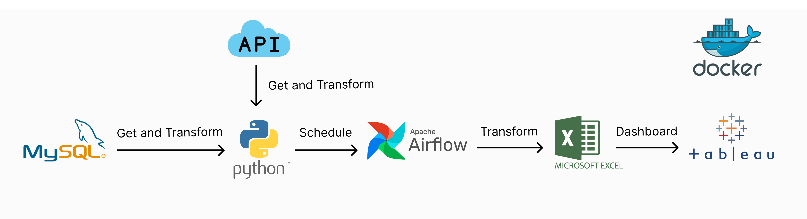

# Kinetik Relawan
The project aims to record the kinetic movement activities of volunteers throughout Indonesia, starting from campaigning activities, community empowerment through training to enhance the skills of the community, social activities aimed at mutual assistance during natural disasters. The goal is to create a dashboard map that displays the positions of volunteers, shows the number of activities per district, and the types of ongoing activities.

## About the Data
The data utilized encompasses various sources, including APIs, databases, and Google Sheets. From these data sources, data extraction is performed, followed by transformation to merge them into a unified data source. Subsequently, address lookup is conducted with the aim of obtaining coordinates as part of the mapping effort. Afterward, the data undergoes scheduled updates every day at 12:00 AM

## Architecture

